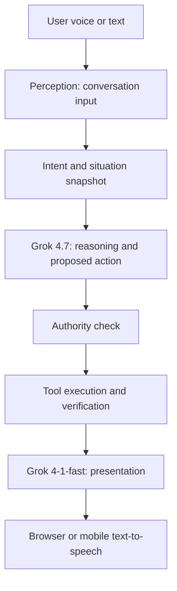

# J.A.R.V.I.S.

J.A.R.V.I.S. is a browser voice assistant with a Three.js orb, a Socket.IO backend, and an optional Expo mobile client. The backend uses the OpenAI JavaScript SDK against the xAI Responses endpoint. Model names, persona, response modes, and policy defaults live in [backend/utils/jarvis.config.js](backend/utils/jarvis.config.js).

## Run locally

Install Node.js and npm. Use two terminals from the repository root.

**Backend**

```powershell
cd backend
npm install
```

Copy [backend/.env.example](backend/.env.example) to `backend/.env` and set your full xAI API key. The hotel provider settings are needed only for external booking:

Backend defaults and limits (model timeout, output tokens, provider timeout, delegation limits, socket history, and server origins) are in [backend/utils/ai.config.js](backend/utils/ai.config.js). Persona, model names, and response modes stay in `backend/utils/jarvis.config.js`. Environment variables supply credentials and deployment-specific URLs.

```dotenv
XAI_API_KEY=your_full_xai_api_key
PORT=5000
CLIENT_ORIGIN=http://localhost:5173
JARVIS_CONTROL_TOKEN=replace_with_a_long_random_secret
HOTEL_PROVIDER_BASE_URL=https://your-hotel-provider.example/api/
HOTEL_PROVIDER_API_KEY=your_server_side_provider_key
```

Then start the backend:

```powershell
node --use-system-ca server.js
```

**Browser client**

```powershell
cd frontend
npm install
npm run dev
```

Open the local URL printed by Vite, normally `http://localhost:5173`. If the backend runs elsewhere, set `VITE_SOCKET_URL` in `frontend/.env` to its origin, for example `http://localhost:5000`. If the browser client runs on another origin, set `CLIENT_ORIGIN` in `backend/.env` to that origin.

The mobile client has separate setup instructions in [react-native/README.md](react-native/README.md). A physical phone needs the computer's LAN address in `EXPO_PUBLIC_SOCKET_URL`.

## Request flow



The implementation is in [backend/services/aiService.js](backend/services/aiService.js) and [backend/services/orchestration.js](backend/services/orchestration.js). The reasoning model returns a reply, an optional proposed external action, and an optional registered tool call. The authority check runs before tool execution. The presentation model can adjust spacing and paragraph breaks; its output is discarded if it changes the verified reply's content. Raw mode skips the presentation pass.

The tool registry currently provides two verified, read-only tools: `get_current_time` (an IANA time zone, default UTC) and `convert_temperature` (Celsius/Fahrenheit). Tool arguments are validated before execution; a failed verification is never reported as success. The registry and grant check are in [backend/services/toolSystem.js](backend/services/toolSystem.js).

No calendar, navigation, messaging, device, sensor, or emergency service is connected. The config expresses a preference for delegated autonomy and SOS, but SOS has no operational tools. External actions require a connected provider and a scoped grant.

### Hotel booking executor

The backend recognises “book me the usual hotel for next Friday” independently of both models. This recognised action goes straight to the executor, so a model response or API outage cannot approve or block it. [backend/services/hotelBookingExecutor.js](backend/services/hotelBookingExecutor.js) resolves “usual hotel” from a trusted profile and interprets “next Friday” as Friday of the following calendar week in the profile's time zone. It requires the hotel ID and name, time zone, number of nights, and guest count.

A booking delegation must be stored on the server and scoped to the user, hotel, check-in date range, maximum nights, maximum guests, total price, currency, and expiry. The executor checks that grant, requests an all-in quote, checks the quote against the grant, books with an idempotency key, and confirms the booking through a separate provider verification call. It reports success only when the provider's confirmation matches the requested stay and quoted total.

Hotel provider controls are available through the backend Socket.IO events `tools:unlock`, `tools:connect`, `tools:delegateHotel`, and `tools:disconnect`. The browser UI does not expose these controls. Grants are held in memory for one Socket.IO session and disappear when the connection ends or the backend restarts. The provider credential remains on the server; a prompt cannot supply credentials or grant itself authority.

The hotel adapter expects this HTTP contract at `HOTEL_PROVIDER_BASE_URL` (Bearer authentication with `HOTEL_PROVIDER_API_KEY`):

| Request | Expected response |
| --- | --- |
| `GET health` | `{"status":"ok"}` |
| `POST quotes` with `hotelId`, `checkIn`, `nights`, `guests` | `quoteId`, matching stay fields, all-in `total`, `currency`, `expiresAt` |
| `POST bookings` with `quoteId` and an `Idempotency-Key` header | `bookingId` |
| `GET bookings/{bookingId}` | `status:"confirmed"`, matching booking ID, stay fields, total, and currency |

The backend accepts HTTPS provider URLs, plus localhost HTTP for development. The provider must honour the idempotency key. Without a compatible configured provider, hotel requests make no booking.

## Voice behaviour

On connection, the backend checks a signed visitor token and uses the visitor's time zone to determine morning, afternoon, evening, or night. It asks the personality model for a greeting appropriate to that period and to a first or returning visit, using recent greetings as context to avoid repetition. The browser stores the token in local storage; the Expo client stores it in SecureStore. A Socket.IO connection ID changes on every connection, so it is not used as a returning-visitor identifier. The backend stores a local signing secret in the ignored `backend/.visitor-secret` file so return visits survive restarts. Set `JARVIS_VISITOR_SECRET` in `backend/.env` when deploying or running multiple backend instances. The token identifies a returning device, not an authenticated person.

The browser displays the generated greeting and attempts to speak it with the Web Speech API. If greeting generation fails, the clients show an error and do not speak a fixed fallback. It prefers Microsoft David when that voice is available. Browser autoplay rules may require user interaction before audio can play. Speech recognition also depends on browser support and microphone permission.

The backend keeps the last 20 conversation messages for each Socket.IO connection. This history is held in memory and is lost when the connection ends or the server restarts.

## API and checks

`GET /api/health` returns backend health. `POST /api/ai/chat` accepts a body such as:

```json
{
  "responseMode": "operator",
  "messages": [{ "role": "user", "content": "Help me plan my day." }]
}
```

Available response modes are `operator`, `raw`, `brief`, `social`, `research`, and `crisis`. The API also accepts `/api/ai/affect`; it still runs the reasoning and authority stages before presentation.

Run the backend tests and browser build from their respective directories:

```powershell
cd backend
npm test
```

```powershell
cd frontend
npm run build
```

The backend tests use a local mock Responses endpoint. They check mode selection, content preservation, and rejection of unavailable actions; they do not make a live xAI request.
